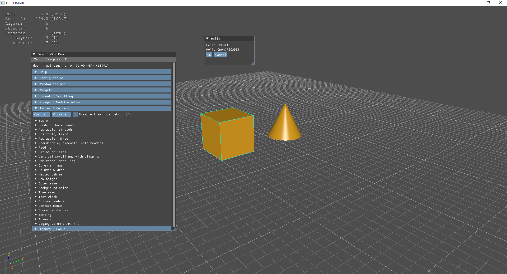

# OcctImgui

OpenCASCADE + GLFW + IMGUI Sample.

## Changes

This fork includes several modifications from the original repository:

1. Updated build configurations and dependencies
2. Added support for STEP model meshing functionality
3. Integrated Netgen meshing library
4. Modified CMake configuration to use newer versions of dependencies
5. Enhanced integration between OpenCASCADE and ImGui for mesh visualization

The main goal of these changes is to demonstrate STEP model meshing capabilities using OpenCASCADE and Netgen, with an interactive ImGui-based interface for visualization and control.



<https://tracker.dev.opencascade.org/view.php?id=33485>

## OpenCASCADE

  <https://dev.opencascade.org/>
  
  <https://github.com/Open-Cascade-SAS/OCCT>

  Open CASCADE Technology (OCCT) a software
development platform providing services for 3D surface and solid modeling, CAD
data exchange, and visualization. Most of OCCT functionality is available in
the form of C++ libraries. OCCT can be best applied in development of software
dealing with 3D modeling (CAD), manufacturing / measuring (CAM) or numerical
simulation (CAE).
  
## IMGUI

  <https://github.com/ocornut/imgui>

  Dear ImGui is a bloat-free graphical user interface library for C++. It outputs optimized vertex buffers that you can render anytime in your 3D-pipeline-enabled application. It is fast, portable, renderer agnostic, and self-contained (no external dependencies).

Dear ImGui is designed to enable fast iterations and to empower programmers to create content creation tools and visualization / debug tools (as opposed to UI for the average end-user). It favors simplicity and productivity toward this goal and lacks certain features commonly found in more high-level libraries.

Dear ImGui is particularly suited to integration in game engines (for tooling), real-time 3D applications, fullscreen applications, embedded applications, or any applications on console platforms where operating system features are non-standard.

## GLFW

  <https://github.com/glfw/glfw>

  GLFW is an Open Source, multi-platform library for OpenGL, OpenGL ES and Vulkan application development. It provides a simple, platform-independent API for creating windows, contexts and surfaces, reading input, handling events, etc.

GLFW natively supports Windows, macOS and Linux and other Unix-like systems. On Linux both X11 and Wayland are supported.

GLFW is licensed under the zlib/libpng license.

## Build

Use VCPKG to manage 3rd-party libraries (OpenCASCADE, netgen...)

```bash
cmake -DCMAKE_CXX_STANDARD=17 ..
```

## Logging System

The application uses a hierarchical logging system built on top of spdlog. This system provides structured logging with context information, function scope tracking, and safe initialization patterns.

### Key Features

- **Hierarchical Loggers**: Organized by module (e.g., "app", "view.occt", "mvvm")
- **Context IDs**: Track specific sessions or operations
- **Function Scope Logging**: Automatically log function entry and exit
- **Thread-Safe**: Safe for multi-threaded environments
- **Static Initialization Safety**: Uses Meyer's Singleton pattern to avoid static initialization order issues

### Usage Guide

#### Getting a Logger

```cpp
// Get a module logger
auto logger = Utils::Logger::getLogger("your.module.name");

// Or use predefined functions
auto appLogger = getAppLogger();
auto viewManagerLogger = getViewManagerLogger();
auto mvvmLogger = getMvvmLogger();
```

#### Logging at Different Levels

```cpp
logger->trace("Trace message: {}", value);
logger->debug("Debug message: {}", value);
logger->info("Info message: {}", value);
logger->warn("Warning message: {}", value);
logger->error("Error message: {}", value);
logger->critical("Critical message: {}", value);
```

#### Setting Context ID

```cpp
// Set a context ID to track specific operations
logger->setContextId("session-123");
```

#### Function Scope Logging

```cpp
void yourFunction() {
    // Automatically logs function entry and exit
    LOG_FUNCTION_SCOPE(logger, "yourFunction");
    
    // Function code...
}
```

#### Creating Child Loggers

```cpp
// Create a hierarchical logger structure
auto childLogger = logger->createChild("submodule");
```

### Implementation Details

- Loggers are implemented as shared pointers with safe initialization
- The `Logger` class inherits from `std::enable_shared_from_this` for safe shared pointer creation
- RAII pattern ensures function exit is logged even when exceptions occur
- Each module has its own logger function (e.g., `getAppLogger()`) to ensure safe static initialization

## Using the Signal and Property System

The application implements a reactive property and signal system based on Boost.Signals2 to facilitate communication between components in the MVVM architecture.

### Property System

The `MVVM::Property<T>` class provides a way to store values and notify observers when they change:

```cpp
// Create a property with initial value
MVVM::Property<int> count(0);

// Get the current value
int currentCount = count.get();

// Set a new value
count.set(10);

// Use the assignment operator
count = 20;
```

### Connecting to Property Changes

You can observe property changes by connecting to the `valueChanged` signal:

```cpp
// Connect to property changes
auto connection = count.valueChanged.connect([](const int& oldValue, const int& newValue) {
    std::cout << "Count changed from " << oldValue << " to " << newValue << std::endl;
});

// Later, disconnect when no longer needed
connection.disconnect();
```

### Property Binding

Properties can be bound to each other, so that changes to one property automatically propagate to another:

```cpp
// Create source and target properties
MVVM::Property<std::string> source("Hello");
MVVM::Property<std::string> target;

// Bind target to source (target will automatically update when source changes)
auto bindConn = target.bindTo(source);

// Change source, target updates automatically
source.set("World");
```

### Computed Properties

You can create properties that compute their values based on other properties:

```cpp
// Create properties
MVVM::Property<int> width(5);
MVVM::Property<int> height(10);
MVVM::Property<int> area;

// Bind area as a computed property
auto computedConns = area.bindComputed<MVVM::Property<int>, MVVM::Property<int>>(
    [](const int& w, const int& h) { return w * h; },
    width, height
);

// Change width or height, area updates automatically
width.set(7);
```

### Signal System

The `MVVM::Signal<Args...>` class provides a type-safe way to implement the observer pattern:

```cpp
// Define a signal
MVVM::Signal<int, std::string> mySignal;

// Connect a slot (supports any callable object: lambdas, function objects, etc.)
auto connection = mySignal.connect([](int value, const std::string& text) {
    std::cout << "Received: " << value << ", " << text << std::endl;
});

// Connect a member function
class MyClass {
public:
    void onSignal(int value, const std::string& text) {
        std::cout << "MyClass received: " << value << ", " << text << std::endl;
    }
};

MyClass instance;
auto memberConn = mySignal.connect([&instance](int value, const std::string& text) {
    instance.onSignal(value, text);
});

// Emit the signal
mySignal.emit(42, "Hello");

// Alternatively, use the function call operator
mySignal(42, "Hello");

// Disconnect when done
connection.disconnect();
memberConn.disconnect();
```

### Connection Management

The `MVVM::ConnectionTracker` class helps manage multiple connections:

```cpp
// Create a connection tracker
MVVM::ConnectionTracker tracker;

// Track connections
tracker.track(signal1.connect(slot1));
tracker.track(signal2.connect(slot2));

// Disconnect all when done
tracker.disconnectAll();
```

### ScopedConnection

The `MVVM::ScopedConnection` class provides RAII-style connection management:

```cpp
// Create a scoped connection
{
    MVVM::ScopedConnection conn(signal.connect(slot));
    // Connection is automatically disconnected when conn goes out of scope
}
```

### MessageBus System

The `MVVM::MessageBus` class provides a centralized communication system for loosely coupled components:

```cpp
// Create a message bus
auto messageBus = std::make_shared<MVVM::MessageBus>();

// Subscribe to messages (supports any callable object)
messageBus->subscribe(MVVM::MessageBus::MessageType::ModelChanged, 
    [](const MVVM::MessageBus::Message& message) {
        if (message.data.type() == typeid(std::string)) {
            std::cout << "Model changed: " << std::any_cast<std::string>(message.data) << std::endl;
        }
    });

// Using function objects
struct MessageHandler {
    void operator()(const MVVM::MessageBus::Message& message) {
        std::cout << "Handler received message" << std::endl;
    }
};
messageBus->subscribe(MVVM::MessageBus::MessageType::ViewChanged, MessageHandler());

// Using member functions (via lambda)
class Observer {
public:
    void onMessage(const MVVM::MessageBus::Message& message) {
        std::cout << "Observer received message" << std::endl;
    }
};

Observer observer;
messageBus->subscribe(MVVM::MessageBus::MessageType::SelectionChanged, 
    [&observer](const MVVM::MessageBus::Message& msg) {
        observer.onMessage(msg);
    });

// Publish a message
MVVM::MessageBus::Message message;
message.type = MVVM::MessageBus::MessageType::ModelChanged;
message.data = std::string("Model updated");
messageBus->publish(message);
```

### Combining Signal and MessageBus

The Signal and MessageBus systems can be used together to create a flexible communication architecture:

```cpp
// Component with direct signals
class Model {
public:
    Model(std::shared_ptr<MVVM::MessageBus> bus) : messageBus(bus) {}
    
    // Direct signal for closely coupled components
    MVVM::Signal<int> valueChanged;
    
    void setValue(int newValue) {
        if (value != newValue) {
            value = newValue;
            
            // Emit direct signal
            valueChanged.emit(value);
            
            // Also publish to message bus for loosely coupled components
            MVVM::MessageBus::Message message;
            message.type = MVVM::MessageBus::MessageType::ModelChanged;
            message.data = std::string("Value changed to " + std::to_string(value));
            messageBus->publish(message);
        }
    }
    
private:
    int value = 0;
    std::shared_ptr<MVVM::MessageBus> messageBus;
};

// Component that listens to both signals and message bus
class ViewModel {
public:
    ViewModel(std::shared_ptr<Model> model, std::shared_ptr<MVVM::MessageBus> bus) 
        : model(model), messageBus(bus) {
        
        // Connect to direct signal
        connections.track(model->valueChanged.connect([this](int newValue) {
            std::cout << "ViewModel: value changed to " << newValue << std::endl;
        }));
        
        // Subscribe to message bus
        messageBus->subscribe(MVVM::MessageBus::MessageType::ModelChanged, 
            [this](const MVVM::MessageBus::Message& message) {
                if (message.data.type() == typeid(std::string)) {
                    std::cout << "ViewModel: " << std::any_cast<std::string>(message.data) << std::endl;
                }
            });
    }
    
private:
    std::shared_ptr<Model> model;
    std::shared_ptr<MVVM::MessageBus> messageBus;
    MVVM::ConnectionTracker connections;
};
```

### When to Use Signal vs MessageBus

- **Signal**: Use for direct, type-safe communication between tightly coupled components. Signals provide strong typing and are efficient for point-to-point communication.

- **MessageBus**: Use for system-wide events or communication between loosely coupled components. MessageBus provides a centralized communication hub with decoupled publishers and subscribers.

### Example Usage in ViewModels

In the application, ViewModels use properties to expose state to Views:

```cpp
// In ViewModel class
MVVM::Property<int> displayMode{0};
MVVM::Property<bool> hasSelectionProperty{false};
MVVM::Property<int> selectionCountProperty{0};

// In View class
void subscribeToEvents() {
    // Connect to display mode property
    auto displayConn = myViewModel->displayMode.valueChanged.connect(
        [this](const int&, const int& newMode) {
            updateVisibility();
            if (!myView.IsNull()) {
                myView->Invalidate();
            }
        });
    myConnections.track(displayConn);
}
```

This reactive property system makes it easy to implement the MVVM pattern, with clear separation of concerns and automatic UI updates when the underlying data changes.
